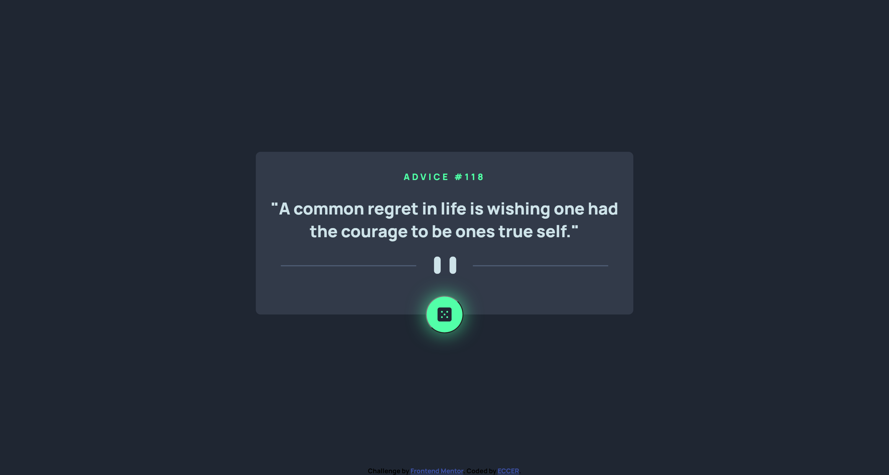

# Frontend Mentor - Advice generator app solution

This is a solution to the [Advice generator app challenge on Frontend Mentor](https://www.frontendmentor.io/challenges/advice-generator-app-QdUG-13db). Frontend Mentor challenges help you improve your coding skills by building realistic projects.

## Table of contents

- [Overview](#overview)
  - [The challenge](#the-challenge)
  - [Screenshot](#screenshot)
  - [Links](#links)
- [My process](#my-process)
  - [Built with](#built-with)
  - [What I learned](#what-i-learned)
  - [Continued development](#continued-development)
- [Author](#author)

## Overview

### The challenge

Users should be able to:

- View the optimal layout for the app depending on their device's screen size
- See hover states for all interactive elements on the page
- Generate a new piece of advice by clicking the dice icon

### Screenshot



### Links

- Solution URL: [github](https://github.com/ECCER/advice-generator)
- Live Site URL: [vercel](https://vercel.com/eccer/advice-generator)

## My process

### Built with

- Semantic HTML5 markup
- CSS custom properties
- Flexbox
- Mobile-first workflow
- Async - await

### What I learned

This is my first time consuming an API, use async and await to achieve it

```js
boton.addEventListener("click", async() => {
    try {
      const resp = await fetch('https://api.adviceslip.com/advice');
      const data = await resp.json();
      const slip = data.slip;
      const {id, advice} = slip
      
      const numberDom = document.querySelector('span');
      const adviceDom = document.querySelector('#quote');
  
      numberDom.textContent = `#${id}`;
      adviceDom.textContent = `"${advice}"`;
    } catch (error) {
      console.warn(error);
    }
});
```

### Continued development

I would like to learn more about the consumption of API's. And the other ways to use it like with promises and callbacks.

## Author

- Website - [Eduardo Calli](https://www.linkedin.com/in/edu-callm/)
- Frontend Mentor - [@ECCER](https://www.frontendmentor.io/profile/ECCER)
